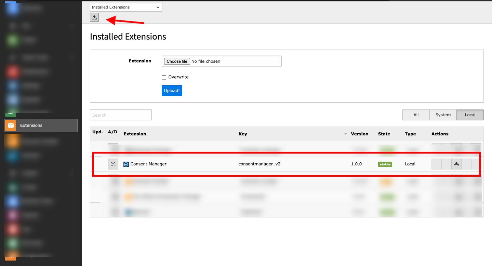
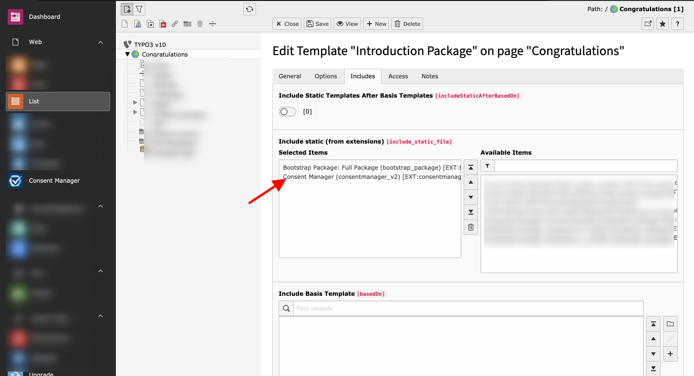
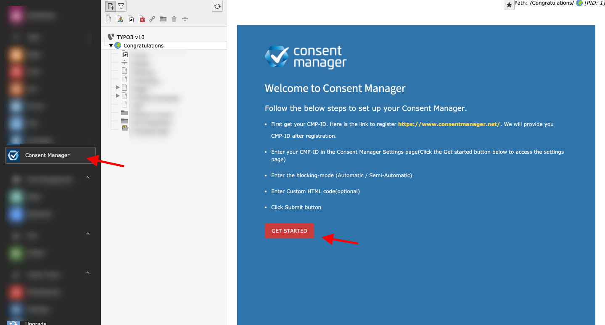
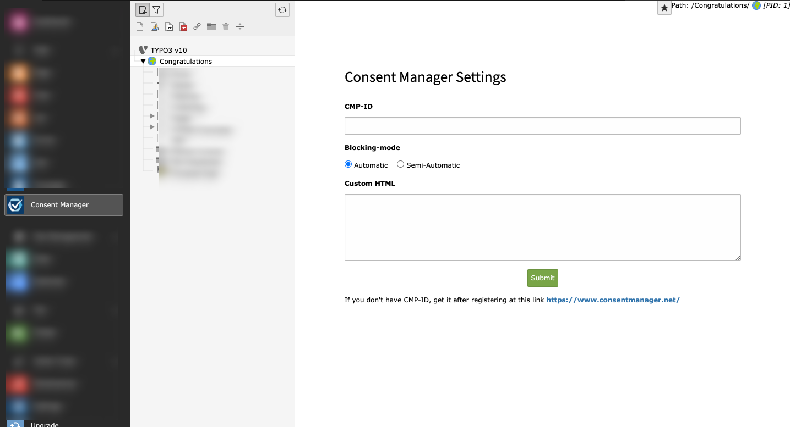

.. include:: ../Includes.txt

.. _installation:

============
Installation
============

It is very easy to install the extension. Download the extension from the TYPO3 repository.

1. Install the extension using the "Extension Manager" module.

   Upload Extension

2. Include the extension in static TS template on the root page.

   Include Static Template

3. Access the backend module & make your settings.

   Information (Step 1)

   Settings (Step 2)
