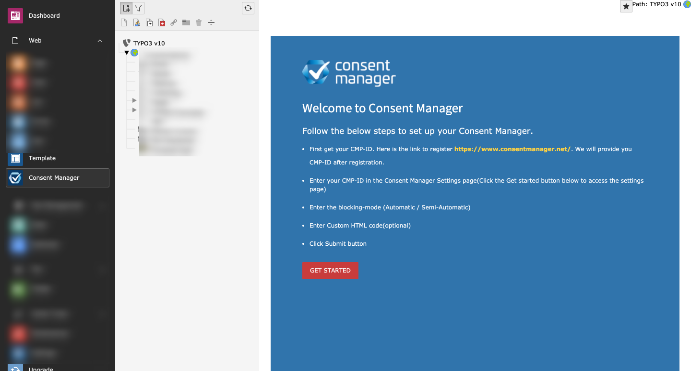
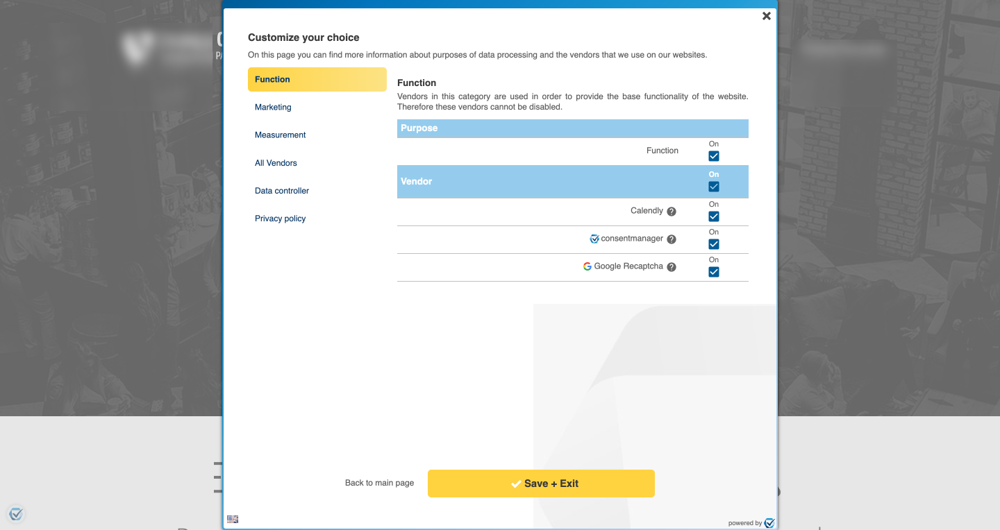

.. include:: ../Includes.txt

.. _introduction:

============
About consentmanager
============

Consentmanager is a GDPR / CCPA consent management solution (SaaS, Software as a Service). In simple words a "cookie banner". This tool allows our clients to ask website visitors for consent and/or enable opt-out from data processing, cookies, sale of personal information and so on. This helps to fulfil the legal requirements under GDPR, CCPA and other legislations.

What does it do?
================

In order to use this service, a website owner will register on our website https://www.consentmanager.net/, get an account, configure all the settings and then get a HTML code. This HTML code needs to be placed into the website using this extension. The code will display our consent layer, perform the blocking (in case of no consent/opt-out) and track some basic statistics.

The integration process sounds simple; 

1. Get the code 
2. Copy it 
3. Add to the "consentmanager_v2" extension 
4. Save it"

Screenshots
===========

Backend:

Frontend:

